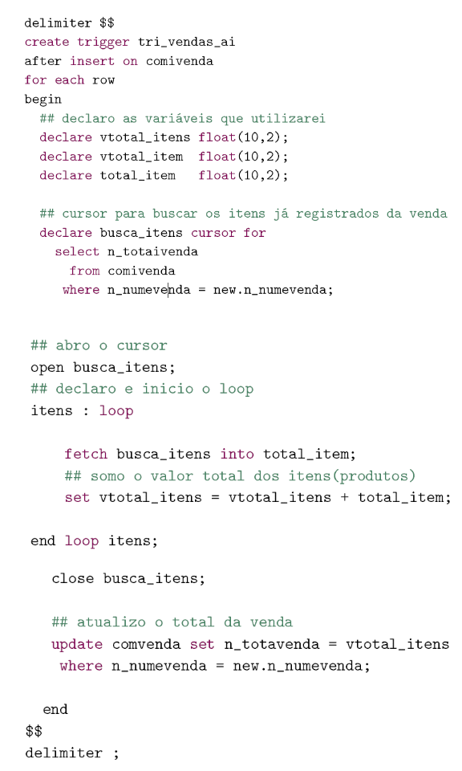

## Projeto de Branco de Dados - Atividade 4

<!-- markdownlint-disable -->

    Atividade 4, para créditos na disciplina de Projeto de Banco de dados, Solicitado pelo professor Diogo Francisco B. Rodrigues

<table>
 
  <tr>
    <td align="center"><a href="https://github.com/DIOGOBRODRIGUES"> <b>DIOGO F B RODRIGUES
</b></a> </td>
  </tr>
</table>

 

1. O cálculo da comissão baseado no valor do totalde vendas, foi realizado a partir de gatilhos desenvolvidos emaula. Porém, estamos somando manualmente seus itens e inserindo no campon_totavenda. Isso pode fazer com que algum erro ocorra, diferentementede quando se insere a partir de uma aplicação.Entretanto, podemos fazer com que esse cálculo seja realizado automaticamente, utilizando uma trigger.

Desta vez, utilizeos tipos after insert(depois de inserir) e after update(depois de alterar) na tabela comivenda(itens da venda),para que, depois de inserir os produtos, o valor do seu total seja calculado e o campo n_totavenda seja atualizado.Abaixo está um código que precisa ser terminadode ser implementado para executar a tarefa acima.

 
 

## Resolução

- `trigger_vendas.sql`: resolução da questão
